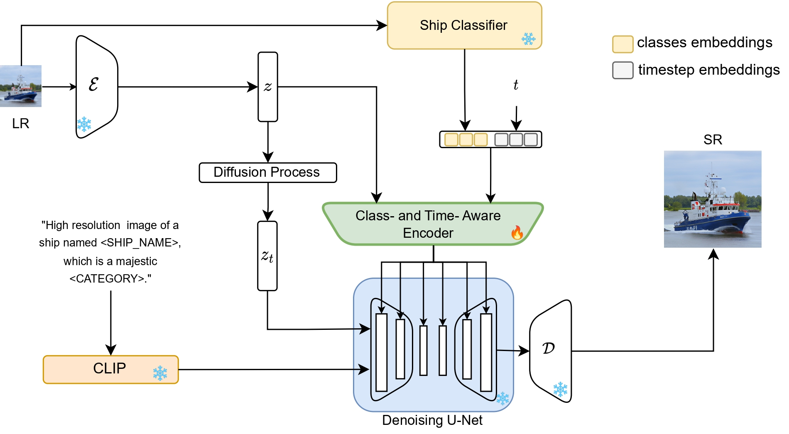
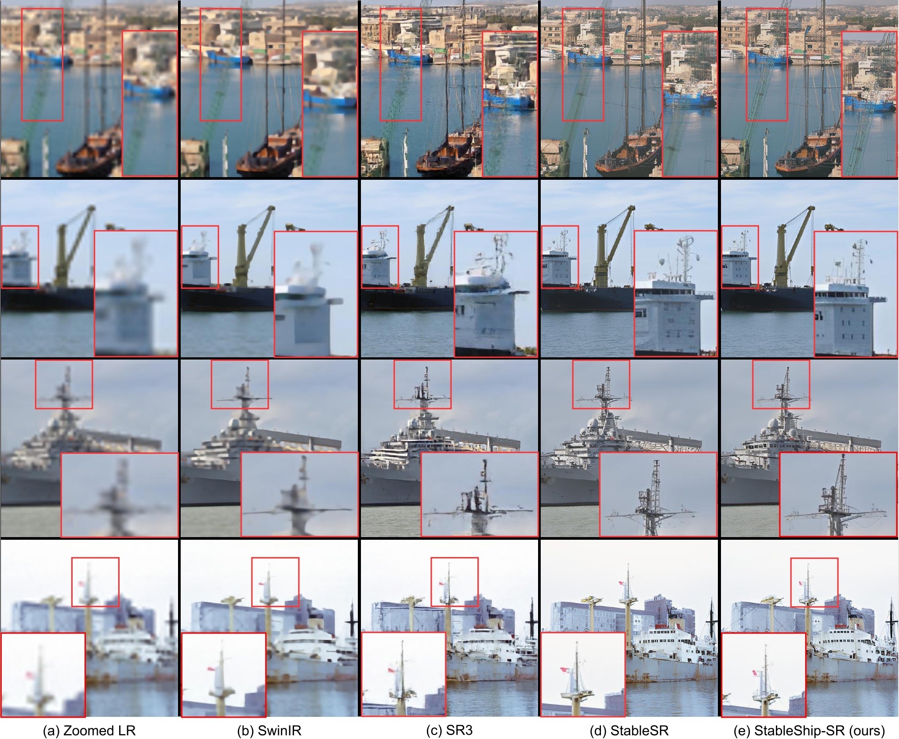

# Ship in Sight: Diffusion Models for Ship-Image Super Resolution


Official PyTorch repository for Ship in Sight: Diffusion Models for Ship-Image Super Resolution, WCCI 2024.
### Abstract :bookmark_tabs:
In recent years, remarkable advancements have been achieved in the field of image generation, primarily driven by the escalating demand for high-quality outcomes across various image generation subtasks, such as inpainting, denoising, and super resolution. A major effort is devoted to exploring the application of super-resolution techniques to enhance the quality of low-resolution images. In this context, our method explores in depth the problem of ship image super resolution, which is crucial for coastal and port surveillance. 

We investigate the opportunity given by the growing interest in text-to-image diffusion models, taking advantage of the prior knowledge that such foundation models have already learned. In particular, we present a diffusion-model-based architecture that leverages text conditioning during training while being class-aware, to best preserve the crucial details of the ships during the generation of the super-resoluted image. Since the specificity of this task and the scarcity availability of off-the-shelf data, we also introduce a large labeled ship dataset scraped from online ship images, mostly from [ShipSpotting](https://www.shipspotting.com/) website. 

Our method achieves more robust results than other deep learning models previously employed for super resolution, as proven by the multiple experiments performed. Moreover, we investigate how this model can benefit downstream tasks, such as classification and object detection, thus emphasizing practical implementation in a real-world scenario. Experimental results show flexibility, reliability, and impressive performance of the proposed framework over state-of-the-art methods for different tasks.


[Paper](https://arxiv.org/abs/2403.18370) | [Project Page]() | [Video]() | [WebUI]() |


[Luigi Sigillo](https://luigisigillo.github.io/), [Riccardo Fosco Gramaccioni](https://scholar.google.it/citations?user=3nBFVm4AAAAJ&hl=it&oi=ao), [Alessandro Nicolosi](), [Danilo Comminiello](https://danilocomminiello.site.uniroma1.it/home)

[ISPAMM Lab](https://ispamm.it/), Sapienza University of Rome 
### Model Architecture :clapper:


### Update
- **08.04.2024**: Dataset is released.
- **08.04.2024**: Checkpoints are released.
- **18.03.2024**: Repo is released.


### Demo

[]() 

For more evaluation, please refer to our [paper](https://arxiv.org/abs/2403.18370) for details.

### How to run experiments :computer:
- Pytorch == 1.12.1
- CUDA == 11.7
- pytorch-lightning==1.4.2
- xformers == 0.0.16 (Optional)
- Other required packages in `environment.yaml`
```
# git clone this repository
git clone https://github.com/luigisigillo/ShipinSight.git
cd ShipinSight

# Create a conda environment and activate it
conda env create --file environment.yaml
conda activate ShipinSight

# Install xformers
conda install xformers -c xformers/label/dev

# Install taming & clip
pip install -e git+https://github.com/CompVis/taming-transformers.git@master#egg=taming-transformers
pip install -e git+https://github.com/openai/CLIP.git@main#egg=clip
pip install -e .
```

### Running Examples

#### Train
Download the pretrained Stable Diffusion models from [[HuggingFace](https://huggingface.co/stabilityai/stable-diffusion-2-1-base)]

```
python main.py --train --base configs/shipinsight/v2-finetune_text_T_512.yaml --gpus GPU_ID, --name NAME --scale_lr False
```


#### Resume

```
python main.py --train --base configs/shipinsight/v2-finetune_text_T_512.yaml --gpus GPU_ID, --resume RESUME_PATH --scale_lr False
```

#### Test directly

Download the Diffusion and autoencoder pretrained models from [Google Drive](https://drive.google.com/drive/folders/1eElVRNGAOjFpGsEDIzjDTggAURWoMEIT?usp=drive_link).

- Test on 128 512: You need at least 10G GPU memory to run this script (batchsize 2 by default)
```
python scripts/sr_val_ddpm_text_T_vqganfin_old.py --config configs/shipinsight/v2-finetune_text_T_512.yaml --ckpt CKPT_PATH --vqgan_ckpt VQGANCKPT_PATH --init-img INPUT_PATH --outdir OUT_DIR --ddpm_steps 200 --dec_w 0.5 --colorfix_type adain
```

<!-- - Test on arbitrary size w/o chop for autoencoder (for results beyond 512): The memory cost depends on your image size, but is usually above 10G.
```
python scripts/sr_val_ddpm_text_T_vqganfin_oldcanvas.py --config configs/shipinsight/v2-finetune_text_T_512.yaml --ckpt CKPT_PATH --vqgan_ckpt VQGANCKPT_PATH --init-img INPUT_PATH --outdir OUT_DIR --ddpm_steps 200 --dec_w 0.5 --colorfix_type adain
``` -->

<!-- - Test on arbitrary size w/ chop for autoencoder: Current default setting needs at least 18G to run, you may reduce the autoencoder tile size by setting ```--vqgantile_size``` and ```--vqgantile_stride```.
Note the min tile size is 512 and the stride should be smaller than the tile size. A smaller size may introduce more border artifacts.
```
python scripts/sr_val_ddpm_text_T_vqganfin_oldcanvas_tile.py --config configs/shipinsight/v2-finetune_text_T_512.yaml --ckpt CKPT_PATH --vqgan_ckpt VQGANCKPT_PATH --init-img INPUT_PATH --outdir OUT_DIR --ddpm_steps 200 --dec_w 0.5 --colorfix_type adain
``` -->

<!-- - For test on 768 model, you need to set ```--config configs/shipinsight/v2-finetune_text_T_768v.yaml```, ```--input_size 768``` and ```--ckpt```. You can also adjust ```--tile_overlap```, ```--vqgantile_size``` and ```--vqgantile_stride``` accordingly. We did not finetune CFW. -->

### Dataset

To construct such a dataset, a straightforward approach was scraping images from the web. The main source for our dataset is ShipSpotting, which serves as a repository for user uploaded images, hosting a vast collection of ship images, amounting to approximately 3 million. Furthermore, for each image, valuable supplementary information is available, such as the type of the ship, and present and past names.
Next, we made sure that as many images as possible were collected in our dataset, since in deep learning, the quantity of training data directly influences the quality of results.


A larger volume of data enables models to generalize more effectively. Thus we scrape all the images and as a result, the dataset comprises a total of 1.517.702 samples. We exclude many classes of ships from our final analysis and concentrate on the more common and valuable for a real scenario use case. The total number of different classes is 20 and the ship categories included are Bulkers, Containerships, Cruise ships, Dredgers, Fire Fighting Vessels, Floating Sheerlegs, General Cargo, Inland, Livestock Carriers, Passenger Vessels, Patrol Forces, Reefers, Ro-ro, Supply ships, Tankers, Training ships, Tugs, Vehicle Carriers, Wood Chip Carriers. The total amount of samples after this class selection is 507.918.

Download the Dataset from [Google Drive](https://drive.google.com/file/d/1Q6AxT07QptqSJ2BchjyoJfKwAzDwM_qD/view?usp=drive_link).


### Cite
Please cite our work if you found it useful:
```
@misc{sigillo2024ship,
      title={Ship in Sight: Diffusion Models for Ship-Image Super Resolution}, 
      author={Luigi Sigillo and Riccardo Fosco Gramaccioni and Alessandro Nicolosi and Danilo Comminiello},
      year={2024},
      eprint={2403.18370},
      archivePrefix={arXiv},
      primaryClass={cs.CV}
}
```


### Acknowledgement

This project is based on [stablediffusion](https://github.com/Stability-AI/stablediffusion), [latent-diffusion](https://github.com/CompVis/latent-diffusion), [SPADE](https://github.com/NVlabs/SPADE), [mixture-of-diffusers](https://github.com/albarji/mixture-of-diffusers) and [StableSR](https://github.com/iceclear/stablesr). Thanks for their awesome work.
